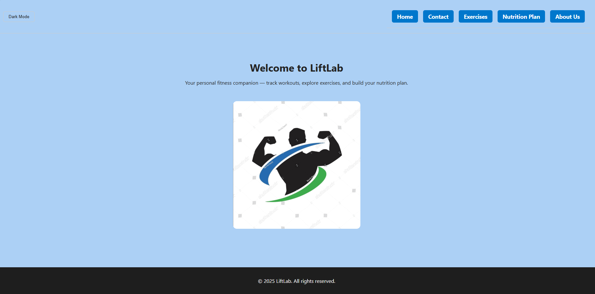
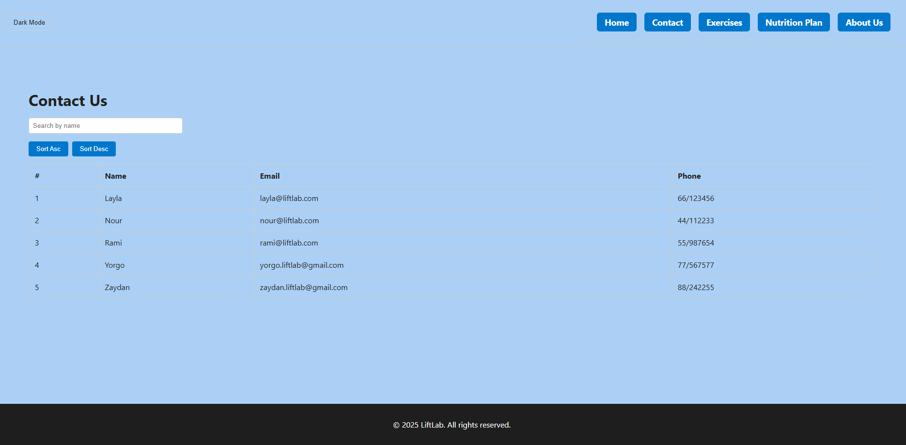
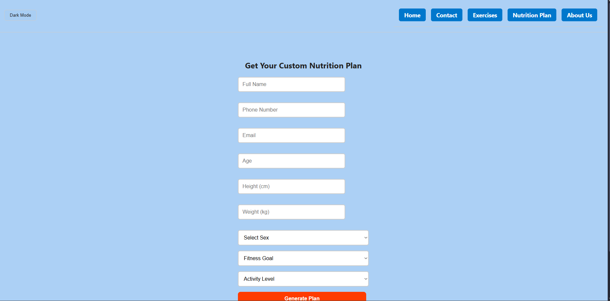
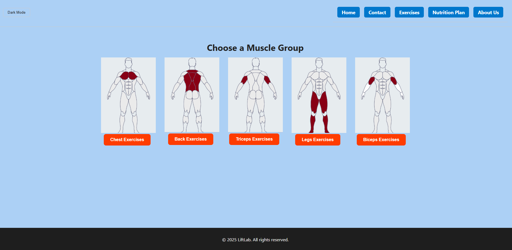
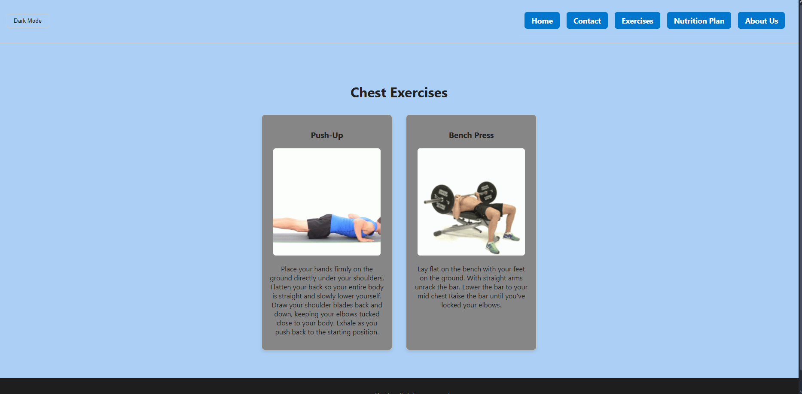
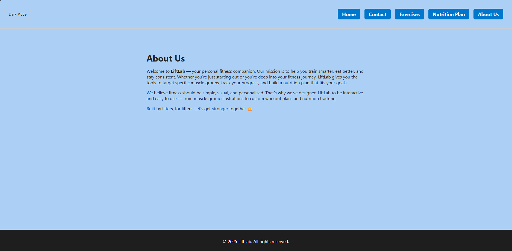

## About The Project
This project is about a Fitness Website that helps the user to select a specific muscle and then it shows them some related exercises of the muscle,with the addition of a option to request a Nutrition Plan based on their specifications 

## Instructions
Download the src file , and then replace the generated src in your folder with the downloaded one.
After, open CMD go to your file destination"cd (your destination)" and run the project"npm start.

## Screenshots

### Home Page

### Contact Page

### Nutrition Plan

### Exercises

### Chest/Exercise

### About Page
